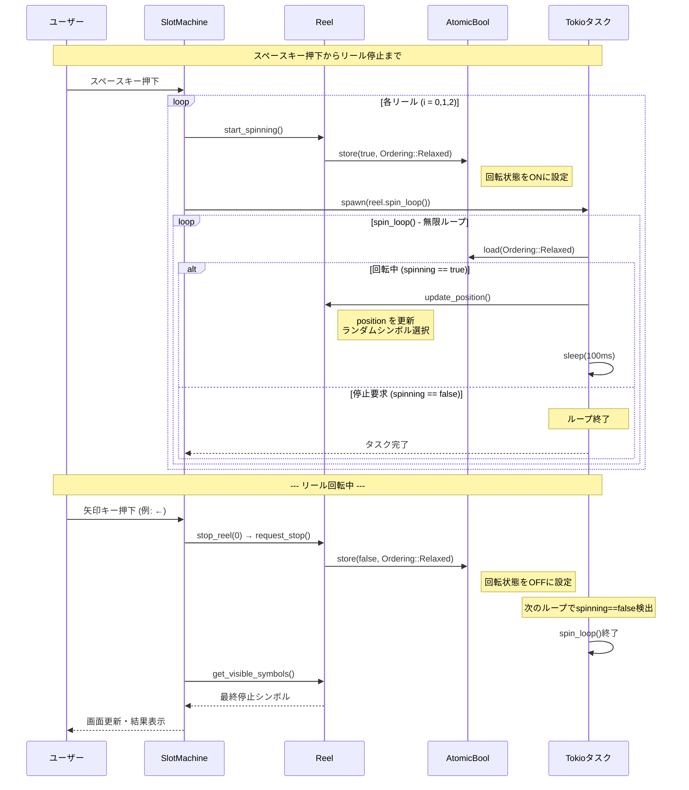

# リール回転詳細 シーケンス図

## 概要
リールの回転開始から停止までの詳細なタイムラインを表現したシーケンス図です。

## リール回転ライフサイクル



## 状態管理の詳細

### AtomicBoolによるスレッドセーフ制御

```mermaid
graph TD
    A[start_spinning()] --> B[spinning.store(true)]
    B --> C[tokio::spawn(spin_loop)]
    C --> D{spinning.load()}
    D -->|true| E[update_position()]
    E --> F[sleep(100ms)]
    F --> D
    D -->|false| G[ループ終了]
    
    H[request_stop()] --> I[spinning.store(false)]
    I --> D
    
    style A fill:#e1f5fe
    style G fill:#ffebee
    style I fill:#fff3e0
```

## タイミング仕様

| 処理 | 間隔 | 説明 |
|------|------|------|
| **spin_loop()** | 100ms | リールシンボル更新周期 |
| **画面更新** | 50ms | メインループの更新間隔 |
| **キー入力** | 100ms | `event::poll()`のタイムアウト |

## 並行実行の可視化

```
時間軸: 0ms -----> 100ms -----> 200ms -----> 300ms
         |           |            |            |
Reel[0]: 🍎 -----> 🍌 -----> 🍇 -----> [停止]
Reel[1]: 🎲 -----> 🎯 -----> 🎪 -----> 🎭
Reel[2]: ⭐ -----> 🌟 -----> ✨ -----> 💫

ユーザー: [Space] -----> [←] -----> -----> [↓]
         全開始    左停止         中停止
```

---

*このシーケンス図は、Rustの非同期処理とAtomicBoolによるスレッドセーフな状態管理を詳細に表現しています。*