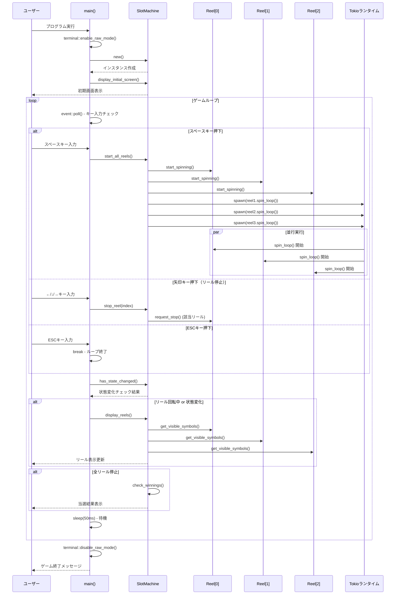

# スロットマシン UMLシーケンス図

## 概要
このドキュメントは、gh-slotスロットマシンゲームのメインゲームフローを表現したUMLシーケンス図です。

## ゲームフロー シーケンス図

## 設計のポイント

### 1. 非同期並行実行
- **Tokioランタイム**により3つのリールが同時に回転
- `tokio::spawn()`でタスクを並行実行
- リアルタイムなユーザー体験を実現

### 2. イベントドリブン設計
- **ノンブロッキング**なキー入力処理
- `event::poll()`によるリアルタイム応答
- ユーザー操作に即座に反応

### 3. 効率的な画面更新
- `has_state_changed()`による状態監視
- 必要な時のみ画面を再描画
- パフォーマンスの最適化

### 4. 適切なリソース管理
- ゲーム開始：`terminal::enable_raw_mode()`
- ゲーム終了：`terminal::disable_raw_mode()`
- メモリリークを防ぐ適切なクリーンアップ

## キー操作フロー

| キー | 動作 | シーケンス上の処理 |
|------|------|-----------------|
| **スペース** | 全リール回転開始 | `start_all_reels()` → 3つの`tokio::spawn()` |
| **←** | 左リール停止 | `stop_reel(0)` → `request_stop()` |
| **↓** | 中リール停止 | `stop_reel(1)` → `request_stop()` |
| **→** | 右リール停止 | `stop_reel(2)` → `request_stop()` |
| **ESC** | ゲーム終了 | ループ終了 → クリーンアップ |

## 技術仕様

- **言語**: Rust (Edition 2021)
- **非同期ランタイム**: Tokio (current_thread flavor)
- **ターミナルUI**: crossterm
- **アーキテクチャ**: 非同期イベントドリブン

---

*このシーケンス図は、gh-slot v1.7.0のアーキテクチャを表現しています。*